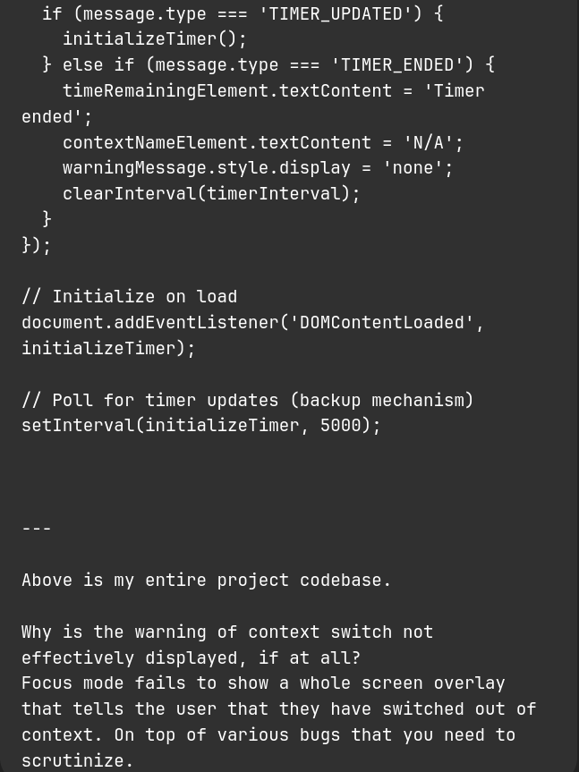

**Project Approach:**
Instead of using github branches I think for our special case, We're starting with one baseline product. Each of us will build our own version on top of it. We're doing this because when you use an LLM to build features on a growing codebase, shit breaks constantly and you end up playing whack-a-mole with the AI. This way, we each deal with our own breaking code instead of all fighting the same problems.
In the end we advocate for which version is better, which one has less bugs, fulfills the project's missions more, etc. I tried to my best to create a clean typescript project for us to iterate on. With separation of concerns and shit.

**2 Main Improvement Objectives:**
1. A way to let the user know while on focus mode an overlay that pops up that they have drifted out of context, and give them options whether to select:
   - "False positive", so it adds to the context engine that this website is indeed not out of context and to not make the same mistake next time
   - "I understand I'm getting out of context. Let me goof around for 1 minute" (and in order to click that button the reader must wait 10 seconds while taking a deep breathe)
   - "Whoops. Take me back. I want to lock in"
2. Improve the context engine, use light weight pre-trained natural language processing machine learning model. not too complicated.

>Basically, you're free to do whatever if you truly believe it aligns with a better product. I think the overlay popup is important.

# How to use LLM to fix or create features efficiently(get full context for AI)
>Put scrape.py into the root folder.

>Running scrape.py will scrape the relevant project code so you can paste whatever is inside code_output.txt into ChatGPT o1 or whatever good LLM you have.

> Like so...

##### LLM Example usage

---
# How to run the extension
### Building it first
After cloning the base project...
Go to the root of the project.
>`npm install`
to install all dependencies

>`npm run build`
>to build/package the project

### Running it on Chrome/Chromium browsers
Enable developer mode on the browser. Then click "load unpacked"

When asked where to load -> Go to the /dist folder. The /dist folder is what's created after you type `npm run build`. That is the prod folder in which you will select to load the unpacked extension.
